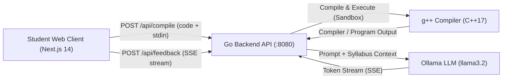

# EDU-TRACE

> An educational support platform for university **Introduction to Programming** courses. It provides a web-based C++ compiler, sandboxed execution with `stdin` support, and real-time pedagogical AI feedback powered by local LLMs via Ollama, aligned with course syllabus criteria.
>
> ⚠️ **Note**: This tool is designed as an assistant for the instructor and students. It is **NOT** an automated grader.

---

## 🌟 Key Features

- **Online C++ Editor**: Modern code editor using CodeMirror with C++ syntax highlighting, auto-indentation, line numbers, and dark mode.
- **Sandboxed Compilation & Execution**: Safe execution via `g++` (`-std=c++17`) with strict memory/output limits, execution timeouts, and custom standard input (`stdin`) for interactive programs (`cin`, `scanf`).
- **Real-Time AI Pedagogical Feedback**:
  - Streams feedback token-by-token using **Server-Sent Events (SSE)**.
  - Contextualized by course syllabus and criteria defined in [`syllabus/`](syllabus/).
  - Structured into constructive sections:
    - ✅ **What went well**
    - 💡 **Suggestions for improvement**
    - 📚 **Key concepts to review**
  - Powered locally by **Ollama** (`llama3.2:latest`) with 100% GPU acceleration (no paid API keys required).
- **Telegram Bot Support**: Built-in Python bot for tracking course group activity, commit history, and evaluation reporting.

---

## 🏗️ System Architecture



---

## 📋 Prerequisites

Before running the project, ensure you have installed:

- **Go**: Version `1.24` or later ([golang.org](https://go.dev/))
- **Node.js**: Version `18.x` or later and `npm` ([nodejs.org](https://nodejs.org/))
- **C++ Compiler (`g++`)**:
  - Ubuntu/Debian: `sudo apt install g++`
  - macOS: `xcode-select --install`
- **bubblewrap + prlimit** (Linux sandbox for student code; the server refuses to start without it unless `SANDBOX=none`):
  - Arch: `sudo pacman -S bubblewrap util-linux`
  - Ubuntu/Debian: `sudo apt install bubblewrap util-linux`
- **Ollama**: Download and install from [ollama.com](https://ollama.com)
  - Pull the recommended model:
    ```bash
    ollama pull llama3.2:latest
    ```

---

## 🚀 Quick Start

### 1. Start Ollama
Ensure the Ollama service is running and the model is available:
```bash
ollama run llama3.2:latest
```

### 2. Start the Go Backend Server
Open a terminal in the project root:
```bash
# TEACHER_CODE is the secret needed to create teacher accounts (share it only with teachers)
TEACHER_CODE='choose-a-secret' go run ./cmd/server/

# Or load every variable from .env (the server does not read .env by itself):
set -a; source .env; set +a; go run ./cmd/server/
```
The backend starts at `http://127.0.0.1:8080` (localhost only).

### 3. Start the Next.js Frontend
Open another terminal:
```bash
cd web
npm install
npm run dev
```
Open **[http://localhost:3000](http://localhost:3000)** in your browser. You will be asked to sign in or create an account.

---

## 🔐 Accounts & Roles

- **Students** register freely and can compile code and request AI feedback.
- **Teachers** create **courses** and, inside each one, **classes** (groups). Each class has a join code; students join with it and send their code from the compiler. In **Mis materias** (`/docente`) teachers open a class to see its students and every submission (code, input/output and the AI guidance the student saw). A teacher only ever sees their own classes.
- To sign in or register as a teacher, open the small `⋮` button in the top-right corner of the login card and pick **Docente**. Teacher registration requires `TEACHER_CODE`; if it is empty, teacher accounts cannot be created. A student account cannot sign in through teacher access.
- Passwords are hashed with PBKDF2-SHA256; sessions are opaque tokens in an `HttpOnly` cookie. Users, sessions, courses, classes and submission metadata live in `data/edutrace.json`; each submission's code is stored in `data/submissions/<id>.json` (all git-ignored).
- **Assignments (talleres):** inside a class the teacher publishes assignments with a statement, an optional due date and attachments (up to 10 files of 10 MB). Students read the statement, download the files and pick the assignment they are working on; their submissions are linked to it and the AI uses the statement as context. Attachments are always served as downloads (`application/octet-stream`, `nosniff`), never rendered in the browser. They are stored in `data/assignments/<id>/`.
- **Two AI feedback modes, always available:** *formal* follows the formative-feedback model of the project document (¿Hacia dónde voy? / ¿Cómo voy? / ¿Qué sigue?); *informal* gives a tutor-style review of code elements (naming, types, loops, functions, layout) plus a quick tip. Neither grades nor writes the solution. Submissions keep whichever feedback the student requested so the teacher can review it.
- **Attempts vs. official submissions:** when a student compiles with a class selected, the compilation is stored as an *attempt* (identical consecutive attempts are skipped; students are told on screen). Only **Enviar** creates the *official submission*. For each student the teacher sees attempts and official submissions separately, data-based stats (attempts, % that compiled, most frequent compiler errors) and can ask the AI for an analysis of the process ("en qué puede mejorar") addressed to the teacher, who makes the final decision. The student's name is not sent to the model.
- Each user can run one compilation and one feedback request at a time; logins are rate-limited per IP.
- Student code is compiled and run inside **bubblewrap**: no network, no access to the host's files (read-only `/usr`, private `/tmp`), and memory/CPU/file-size limits via `prlimit`.

---

## ⚙️ Environment Configuration

Configuration variables can be customized in a `.env` file at the root directory (see [`.env.example`](.env.example)):

```bash
# Backend Server
HOST=127.0.0.1            # use 0.0.0.0 only behind an HTTPS reverse proxy
PORT=8080
GPP_PATH=g++
COMPILE_TIMEOUT_SECS=10
RUN_TIMEOUT_SECS=5
MAX_OUTPUT_SIZE=10240
ALLOWED_ORIGINS=http://localhost:3000
SANDBOX=bwrap             # "none" disables isolation (development only)

# Authentication
DATA_DIR=data
SESSION_TTL_HOURS=72
TEACHER_CODE=             # required to create teacher accounts
COOKIE_SECURE=false       # set to true when served over HTTPS

# Local AI (Ollama)
OLLAMA_BASE_URL=http://localhost:11434
OLLAMA_MODEL=llama3.2:latest
OLLAMA_TIMEOUT=180
OLLAMA_CONTEXT_SIZE=8192

# Telegram Bot (Optional / Python)
TELEGRAM_BOT_TOKEN=
MONGODB_URI=
TELEGRAM_ALLOWED_USER_IDS=
```

---

## 📁 Project Structure

```text
EDU-TRACE/
├── cmd/
│   └── server/
│       └── main.go              # Go application entry point & graceful shutdown
├── internal/
│   ├── ai/
│   │   └── ollama.go            # Ollama streaming client & syllabus loader
│   ├── auth/
│   │   ├── password.go          # PBKDF2 password hashing
│   │   ├── store.go             # Users, sessions & activity (JSON file)
│   │   └── middleware.go        # RequireAuth/RequireRole, rate limits
│   ├── compiler/
│   │   ├── compiler.go          # C++ compilation & stdin execution
│   │   └── sandbox.go           # bubblewrap + prlimit isolation
│   ├── config/
│   │   └── config.go            # Environment variable configuration
│   ├── handler/
│   │   ├── auth.go              # Register/login/logout/me & teacher endpoints
│   │   ├── compile.go           # POST /api/compile handler
│   │   ├── feedback.go          # POST /api/feedback SSE streaming handler
│   │   └── routes.go            # HTTP router, CORS & logging middleware
│   └── model/
│       ├── models.go            # Request/Response data models
│       └── feedback.go          # Feedback data structures
├── syllabus/
│   └── criterios.md             # Pedagogical feedback criteria
├── web/                         # Frontend Application (Next.js 14 + TypeScript)
│   ├── src/
│   │   ├── app/                 # App router pages: / (compiler), /login, /docente
│   │   ├── components/
│   │   │   ├── AuthProvider.tsx # Session context
│   │   │   ├── RequireAuth.tsx  # Route guard by session/role
│   │   │   ├── UserMenu.tsx     # Header account menu
│   │   │   ├── CodeEditor.tsx   # CodeMirror C++ editor component
│   │   │   ├── OutputPanel.tsx  # Compilation/execution output display
│   │   │   └── FeedbackPanel.tsx# Real-time streaming AI feedback display
│   │   └── lib/
│   │       └── api.ts           # REST & SSE fetch client functions
│   ├── package.json
│   └── tailwind.config.ts
├── src/                         # Telegram Bot & Historical tooling (Python)
├── go.mod                       # Go module dependencies
├── .env.example                 # Sample configuration file
└── README.md
```

---

## 🤖 API Endpoints

| Method | Endpoint | Description |
|---|---|---|
| `GET` | `/api/health` | Health-check endpoint, returns `{"status": "ok"}` |
| `POST` | `/api/auth/register` | Creates an account (`role`: `student` or `teacher` + `teacher_code`) |
| `POST` | `/api/auth/login` | Signs in and sets the session cookie |
| `POST` | `/api/auth/logout` | Ends the session |
| `GET` | `/api/auth/me` | Current user 🔒 |
| `POST` | `/api/compile` | Compiles and executes C++ code with optional `stdin` 🔒 |
| `POST` | `/api/feedback` | Streams AI pedagogical feedback token-by-token (SSE) 🔒 |
| `GET` | `/api/teacher/courses` | Teacher's courses with their classes 🔒 teacher |
| `POST` | `/api/teacher/courses` | Create a course 🔒 teacher |
| `POST` | `/api/teacher/courses/{id}/groups` | Create a class (group) with a join code 🔒 teacher |
| `GET` | `/api/teacher/groups/{id}` | Class detail with its students 🔒 teacher (own classes only) |
| `GET` | `/api/teacher/groups/{id}/submissions` | Class submissions (`?student=` to filter, `?kind=official\|attempt\|all`, default `official`) 🔒 teacher |
| `POST` | `/api/teacher/groups/{id}/students/{student}/analysis` | AI analysis of a student's process for the teacher (SSE) 🔒 teacher |
| `GET` | `/api/teacher/submissions/{id}` | Full submission: code, I/O, AI guidance 🔒 teacher |
| `POST` | `/api/teacher/groups/{id}/assignments` | Create an assignment (multipart: `title`, `statement`, optional `due_at`, `files`) 🔒 teacher |
| `GET` | `/api/teacher/groups/{id}/assignments` | Class assignments 🔒 teacher |
| `GET` | `/api/assignments/{id}/files/{file}` | Download an attachment (owner teacher or enrolled student) 🔒 |
| `GET` | `/api/student/assignments` | Assignments of the student's classes 🔒 student |
| `GET` | `/api/student/groups` | Student's classes 🔒 student |
| `POST` | `/api/student/groups/join` | Join a class with its code 🔒 student |
| `POST` | `/api/student/submissions` | Send code to a class (compiled server-side in the sandbox) 🔒 student |
| `GET` | `/api/student/submissions` | Student's recent submissions 🔒 student |

---

## 🤖 Optional: Python Telegram Bot

If you also wish to run the legacy repository analysis bot:
1. Create a virtual environment:
   ```bash
   python3 -m venv .venv
   source .venv/bin/activate
   pip install -r requirements.txt
   ```
2. Populate `TELEGRAM_BOT_TOKEN`, `MONGODB_URI`, and `TELEGRAM_ALLOWED_USER_IDS` in your `.env`.
3. Launch the bot:
   ```bash
   python src/telegram/bot.py
   ```
