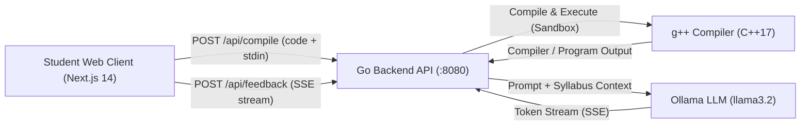

# EDU-TRACE

> An educational support platform for university **Introduction to Programming** courses. It provides a web-based C++ compiler, sandboxed execution with `stdin` support, and real-time pedagogical AI feedback powered by local LLMs via Ollama, aligned with course syllabus criteria.
>
> ⚠️ **Note**: This tool is designed as an assistant for the instructor and students. It is **NOT** an automated grader.

---

## 🌟 Key Features

- **Online C++ Editor**: Modern code editor using CodeMirror with C++ syntax highlighting, auto-indentation, line numbers, and dark mode.
- **Sandboxed Compilation & Execution**: Safe execution via `g++` (`-std=c++17`) with strict memory/output limits, execution timeouts, and custom standard input (`stdin`) for interactive programs (`cin`, `scanf`).
- **Real-Time AI Pedagogical Feedback**:
  - Streams feedback token-by-token using **Server-Sent Events (SSE)**.
  - Contextualized by course syllabus and criteria defined in [`syllabus/`](syllabus/).
  - Structured into constructive sections:
    - ✅ **What went well**
    - 💡 **Suggestions for improvement**
    - 📚 **Key concepts to review**
  - Powered locally by **Ollama** (`llama3.2:latest`) with 100% GPU acceleration (no paid API keys required).
- **Telegram Bot Support**: Built-in Python bot for tracking course group activity, commit history, and evaluation reporting.

---

## 🏗️ System Architecture



---

## 📋 Prerequisites

Before running the project, ensure you have installed:

- **Go**: Version `1.22` or later ([golang.org](https://go.dev/))
- **Node.js**: Version `18.x` or later and `npm` ([nodejs.org](https://nodejs.org/))
- **C++ Compiler (`g++`)**:
  - Ubuntu/Debian: `sudo apt install g++`
  - macOS: `xcode-select --install`
- **Ollama**: Download and install from [ollama.com](https://ollama.com)
  - Pull the recommended model:
    ```bash
    ollama pull llama3.2:latest
    ```

---

## 🚀 Quick Start

### 1. Start Ollama
Ensure the Ollama service is running and the model is available:
```bash
ollama run llama3.2:latest
```

### 2. Start the Go Backend Server
Open a terminal in the project root:
```bash
# Run server directly with Go
go run ./cmd/server/
```
The backend starts at `http://localhost:8080`.

### 3. Start the Next.js Frontend
Open another terminal:
```bash
cd web
npm install
npm run dev
```
Open **[http://localhost:3000](http://localhost:3000)** in your browser.

---

## ⚙️ Environment Configuration

Configuration variables can be customized in a `.env` file at the root directory (see [`.env.example`](.env.example)):

```bash
# Backend Server
PORT=8080
GPP_PATH=g++
COMPILE_TIMEOUT_SECS=10
RUN_TIMEOUT_SECS=5
MAX_OUTPUT_SIZE=10240
ALLOWED_ORIGINS=http://localhost:3000

# Local AI (Ollama)
OLLAMA_BASE_URL=http://localhost:11434
OLLAMA_MODEL=llama3.2:latest
OLLAMA_TIMEOUT=180
OLLAMA_CONTEXT_SIZE=4096

# Telegram Bot (Optional / Python)
TELEGRAM_BOT_TOKEN=
MONGODB_URI=
TELEGRAM_ALLOWED_USER_IDS=
```

---

## 📁 Project Structure

```text
EDU-TRACE/
├── cmd/
│   └── server/
│       └── main.go              # Go application entry point & graceful shutdown
├── internal/
│   ├── ai/
│   │   └── ollama.go            # Ollama streaming client & syllabus loader
│   ├── compiler/
│   │   └── compiler.go          # Sandboxed C++ compilation & stdin execution
│   ├── config/
│   │   └── config.go            # Environment variable configuration
│   ├── handler/
│   │   ├── compile.go           # POST /api/compile handler
│   │   ├── feedback.go          # POST /api/feedback SSE streaming handler
│   │   └── routes.go            # HTTP router, CORS & logging middleware
│   └── model/
│       ├── models.go            # Request/Response data models
│       └── feedback.go          # Feedback data structures
├── syllabus/
│   └── criterios.md             # Pedagogical feedback criteria
├── web/                         # Frontend Application (Next.js 14 + TypeScript)
│   ├── src/
│   │   ├── app/                 # App router pages & layouts
│   │   ├── components/
│   │   │   ├── CodeEditor.tsx   # CodeMirror C++ editor component
│   │   │   ├── OutputPanel.tsx  # Compilation/execution output display
│   │   │   └── FeedbackPanel.tsx# Real-time streaming AI feedback display
│   │   └── lib/
│   │       └── api.ts           # REST & SSE fetch client functions
│   ├── package.json
│   └── tailwind.config.ts
├── src/                         # Telegram Bot & Historical tooling (Python)
├── go.mod                       # Go module dependencies
├── .env.example                 # Sample configuration file
└── README.md
```

---

## 🤖 API Endpoints

| Method | Endpoint | Description |
|---|---|---|
| `GET` | `/api/health` | Health-check endpoint, returns `{"status": "ok"}` |
| `POST` | `/api/compile` | Compiles and executes C++ code with optional `stdin` |
| `POST` | `/api/feedback` | Streams AI pedagogical feedback token-by-token (SSE) |

---

## 🤖 Optional: Python Telegram Bot

If you also wish to run the legacy repository analysis bot:
1. Create a virtual environment:
   ```bash
   python3 -m venv .venv
   source .venv/bin/activate
   pip install -r requirements.txt
   ```
2. Populate `TELEGRAM_BOT_TOKEN`, `MONGODB_URI`, and `TELEGRAM_ALLOWED_USER_IDS` in your `.env`.
3. Launch the bot:
   ```bash
   python src/telegram/bot.py
   ```
